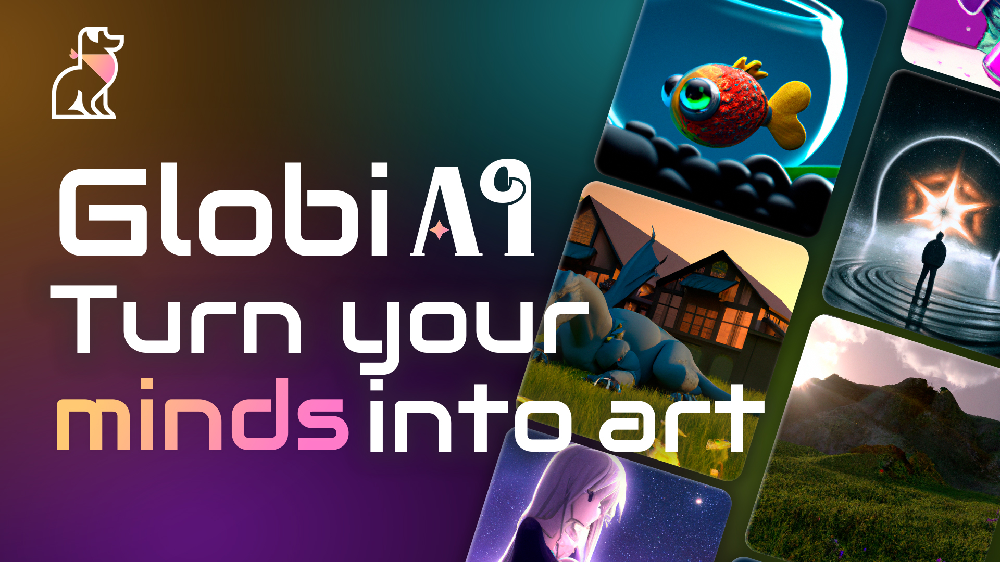

# GlobiAI 

GlobiAI - Website where you can create image from text using OpenAI Api and after share it with community. In this app i implemented JWT and Google Authentication, with uploading profile image and cover image to Database and ability to edit user data. Also user can like post and saw liked post in profile. [Website🍿](https://globiai.netlify.app)

   
